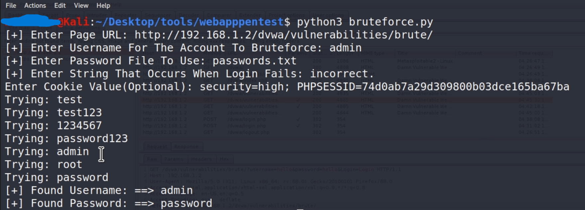

# Bruteforce Tool

A powerful and customizable tool for **brute-forcing** passwords in web applications. This tool is intended for educational and ethical hacking purposes only. Use it responsibly and only on systems you have permission to test.

## 📜 Table of Contents
- [Introduction](#introduction)
- [Features](#features)
- [Installation](#installation)
- [Usage](#usage)
- [Example Output](#example-output)
- [Supported Environments](#supported-environments)
- [Contributions](#contributions)
- [License](#license)

## 📘 Introduction
This tool helps security professionals and ethical hackers in performing brute-force password attacks on login forms. It allows for easy configuration and execution of brute-force attacks against a specified URL, using a wordlist of potential passwords.

**Use responsibly** and only on systems you have explicit permission to test.

## ✨ Features
- **Customizable Bruteforce Attacks**: Configure the target login page, username, and password wordlist for the attack.
- **Efficient and Scalable**: Supports various methods of attack for optimized performance.
- **Command-Line Interface**: Easy-to-use interface for quick configuration and execution.

## 🚀 Installation
Clone the repository and navigate to the project folder.

Install required dependencies using the provided `requirements.txt` file.

## 🛠️ Usage
```bash
cd bruteforce
python3 bruteforce.py
```

### Bruteforce Tool
The brute-force tool is designed to help you test login forms by trying a list of common passwords. Configure the tool by specifying the target URL, username, and the path to your wordlist.

- **URL**: The login page URL you want to attack.
- **USERNAME**: The username for which the password needs to be brute-forced.
- **WORDLIST**: A path to the wordlist file containing potential passwords.

## 📊 Example Output
Here’s a sample output of the bruteforce tool in action:



